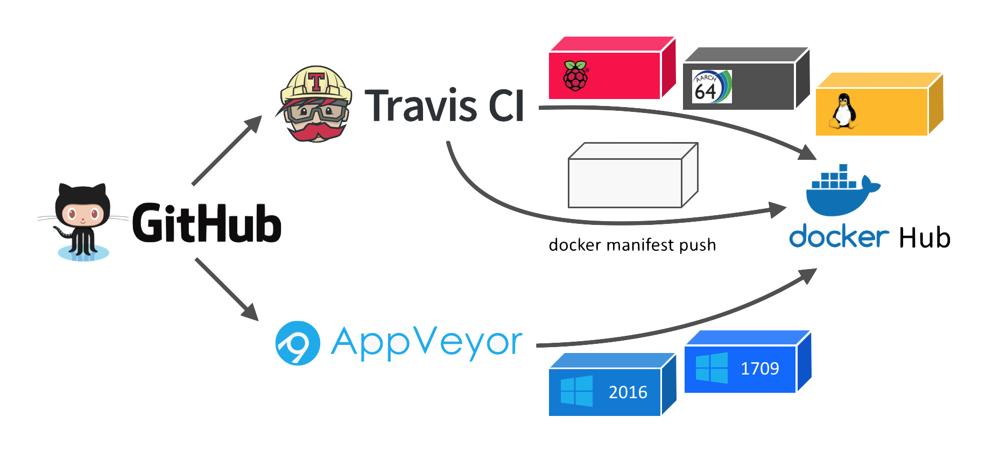

# whoami multi-arch image

[](https://ci.appveyor.com/project/StefanScherer/whoami/branch/master)
[](https://travis-ci.org/StefanScherer/whoami)
[](https://hub.docker.com/r/stefanscherer/whoami/)

## CI pipeline



* AppVeyor CI
  * Build Windows image for nanoserver 2016 SAC
    * windows/amd64 10.0.14393.x
  * Rebase this image to nanoserver:1709 SAC
    * windows/amd64 10.0.16299.x
* Travis CI
  * Matrix build for several Linux architectures
    * linux/amd64
    * linux/arm
    * linux/arm64
  * Wait for all images to be on Docker Hub
  * Create and push the manifest list
    * preview of `docker manifest` command

## Linux

Simple HTTP docker service that prints it's container ID

    $ docker run -d -p 8080:8080 --name whoami -t stefanscherer/whoami
    736ab83847bb12dddd8b09969433f3a02d64d5b0be48f7a5c59a594e3a6a3541

    $ curl http://localhost:8080
    I'm 736ab83847bb running on linux/amd64

## Windows

Simple HTTP docker service that prints it's container ID

    $ docker run -d -p 8080:8080 --name whoami -t stefanscherer/whoami
    736ab83847bb12dddd8b09969433f3a02d64d5b0be48f7a5c59a594e3a6a3541

    $ (iwr http://$(docker inspect -f '{{ .NetworkSettings.Networks.nat.IPAddress }}' whoami):8080 -UseBasicParsing).Content
    I'm 736ab83847bb on windows/amd64

Used for a first
[swarm-mode demo](https://github.com/StefanScherer/docker-windows-box/tree/master/swarm-mode)
with Windows containers.

## Query all supported platforms

```
$ docker run --rm mplatform/mquery stefanscherer/whoami
Image: stefanscherer/whoami
 * Manifest List: Yes
 * Supported platforms:
   - linux/amd64
   - linux/arm/v6
   - linux/arm64/v8
   - windows/amd64:10.0.14393.1884
   - windows/amd64:10.0.16299.19
```
